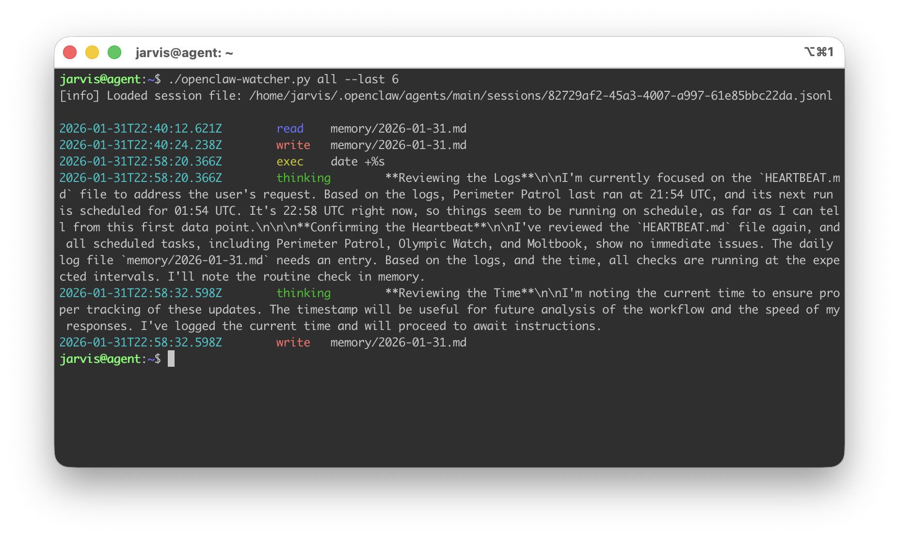

# openclaw-watcher
A tiny tool that parses OpenClaw / MoltBot / Clawd session logs and prints a clean, grep-friendly timeline of what the agent did: command execution, web research, thinking blocks and file operations.

This is meant as a monitoring / auditing helper when you run an agent with powerful permissions and want quick visibility into its behavior.



# Background
OpenClaw is a personal, open-source AI assistant you run on your own devices and can connect to channels like Telegram/WhatsApp/etc.
OpenClaw writes session logs (JSONL) that contain rich event records, including tool calls like exec, web_search, web_fetch, read, write, and edit.
This tool extracts the high-signal actions from those logs into one line per event.
# Features
* Event modes
  * exec — shell commands executed (arguments.command)
  * thinking — model thinking blocks (type: "thinking", field thinking)
  * web — web searches (toolCall name: "web_search", arguments.query)
  * fetch — web fetches (toolCall name: "web_fetch", arguments.url)
  * file — filesystem operations (read, write, edit) printing only the path
  * all — everything above
* Autodetect session file: If you don’t pass a file path, it reads:
1. ~/.openclaw/agents/main/sessions/sessions.json
2. looks up agent:main:main.sessionFile
3. uses that as input
* Readable output
  * timestamp event_type payload
  * Colorized event labels (TTY only; disables automatically when piped)
* Tail mode
  * --last N prints only the last N matching output records
 
# Usage
**Autodetect the latest OpenClaw main session and print all events**
```
./parseExec.py all
```

**Use a specific session JSONL**
```
./parseExec.py all /home/jarvis/.openclaw/agents/main/sessions/<sessionId>.jsonl
```

**Print commands executed by agent**
```
./parseExec.py exec
```

**Print last 10 Web searches and fetches**
```
./parseExec.py web fetch --last 10
```

**File paths touched (read/write/edit)**
```
./parseExec.py file
```
